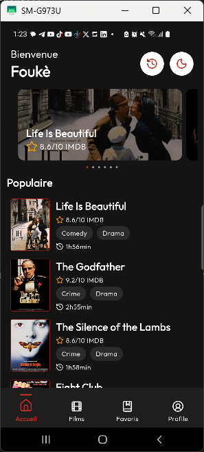
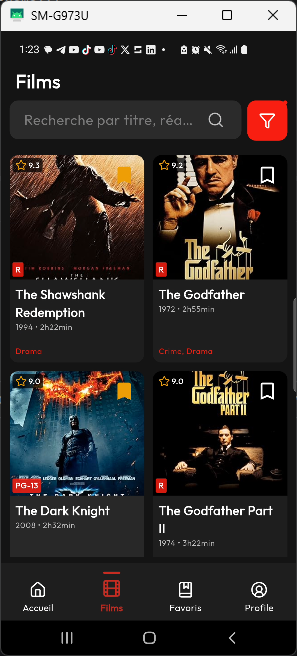

# 🎬 Movify

**Movify** est une application mobile moderne et élégante de découverte de films développée avec **Flutter**. Elle permet d'explorer un vaste catalogue de films, de consulter leurs détails et bandes-annonces, d'organiser ses favoris et sa liste à voir (*Watchlist*), tout en offrant une expérience utilisateur fluide et un mode Sombre / Clair entièrement personnalisable.

---

## 📱 Captures d'écran

| 🏠 Page d'accueil (`Home`) | 🍿 Catalogue de films (`Movies`) |
| :---: | :---: |
|  |  |

---

## ✨ Fonctionnalités Principales

- 🔍 **Découverte & Recherche** : Parcourez les films populaires, les dernières sorties et filtrez par catégories / genres.
- 📖 **Fiche Détaillée** : Consensus, synopsis complet, note moyenne, genres, durée, année de sortie et accès direct aux bandes-annonces.
- ❤️ **Favoris & Watchlist** : Sauvegardez vos films coup de cœur et gérez la liste des films que vous prévoyez de regarder (persistance des données localement).
- 🌓 **Thème Sombre / Clair** : Basculement dynamique du thème de l'application selon vos préférences.
- 🎨 **Design & Typographie** : Interface épurée exploitant les polices **Outfit** et **Lexend**, agrémentée des icônes **Lucide**.
- 🧭 **Navigation Réactive** : Gestion simplifiée des routes et Shell Navigation avec `go_router`.

---

## 🏗️ Architecture du Projet

Le projet adhère aux principes de la **Clean Architecture** afin de séparer clairement les responsabilités et faciliter la maintenance :

```text
lib/
├── core/                  # Configurations globales, constantes, thème et routage
│   ├── constants/
│   ├── extensions/
│   ├── helpers/
│   ├── routing/           # Navigation et routes avec GoRouter
│   └── theme/             # Configuration des thèmes AppTheme (Light & Dark)
├── data/                  # Sources de données et implémentations
│   ├── datasources/       # Accès aux données locales (JSON / SharedPreferences)
│   ├── models/            # Modèles de données (MovieModel, UserModel, etc.)
│   └── repositories/      # Implémentations concrètes des dépôts
├── domain/                # Logique métier et interfaces
│   ├── entities/          # Objets du domaine (Movie, User, etc.)
│   └── repositories/      # Contrats des répertoires
└── presentation/          # Interface Utilisateur (UI)
    ├── pages/             # Écrans (HomePage, MoviesPage, MovieDetailPage, etc.)
    ├── providers/         # Injection de dépendances et états (AppDependencies)
    └── widgets/           # Composants UI réutilisables
```

---

## 🛠️ Technologies & Packages Utilisés

| Package | Version | Usage |
| :--- | :--- | :--- |
| **Flutter** | `>=3.14.0` | Framework de développement cross-platform |
| **[go_router](https://pub.dev/packages/go_router)** | `^17.3.0` | Routage et navigation déclarative |
| **[shared_preferences](https://pub.dev/packages/shared_preferences)** | `^2.5.5` | Persistance locale (Favoris, Watchlist, Thème) |
| **[lucide_icons_flutter](https://pub.dev/packages/lucide_icons_flutter)** | `^3.1.15` | Kit d'icônes vectorielles modernes |
| **[url_launcher](https://pub.dev/packages/url_launcher)** | `^6.3.2` | Ouverture des bandes-annonces et liens externes |

---

## 🚀 Comment Démarrer

### 1. Prérequis

Vérifiez que votre environnement de développement contient :
- [Flutter SDK](https://docs.flutter.dev/get-started/install) (version 3.14+ recommandée)
- [Dart SDK](https://dart.dev/get-dart)
- Un émulateur Android, un simulateur iOS ou un navigateur/appareil physique pour l'exécution.

### 2. Installation

1. **Cloner le projet** :
   ```bash
   git clone https://github.com/Just2sire/movify.git
   cd movify
   ```

2. **Récupérer les packages Flutter** :
   ```bash
   flutter pub get
   ```

### 3. Lancement de l'application

Démarrez l'application sur un appareil connecté :
```bash
flutter run
```

---

## 📂 Structure des Assets

- `assets/images/` : Captures d'écran et éléments visuels de l'application (`home_page.png`, `movies_page.png`).
- `assets/data/` : Base de données locale de films au format JSON (`movies.json`).
- `assets/fonts/` : Polices de caractères personnalisées (*Outfit*, *Lexend*).

---

## 📝 Licence

Projet réalisé dans le cadre d'un apprentissage Flutter. Utilisation et modification libres.
